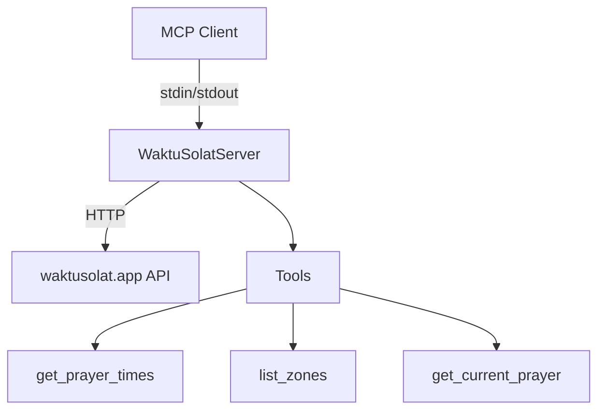
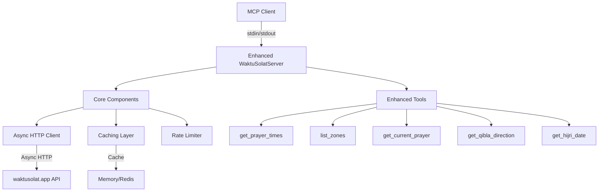

# Malaysia Prayer Time MCP Server Enhancement Plan

## Overview
This plan focuses on enhancing the existing stdio-based MCP server implementation while maintaining full compatibility with MCP clients like Claude, Cline, and Cursor.

## Current Architecture


## Enhanced Architecture


## Key Enhancements

### 1. Async Implementation
- Replace synchronous `requests` with `httpx` for async HTTP calls
- Implement proper async context management
- Improve async error handling
- Use `asyncio` queues for better request management

### 2. Caching Layer
- Add in-memory caching with TTL for prayer times
- Cache zone listings
- Optional Redis support for distributed setups
- Smart cache invalidation strategies

### 3. Performance Optimizations
- Implement connection pooling for HTTP requests
- Add request batching capabilities
- Optimize JSON serialization/deserialization
- Minimize memory usage during operations

### 4. Reliability Improvements
- Enhanced error handling with custom exceptions
- Automatic retries with exponential backoff
- Circuit breaker for API calls
- Health check mechanism

### 5. New Tools
- `get_qibla_direction`: Calculate Qibla direction for a zone
- `get_hijri_date`: Convert Gregorian to Hijri dates
- `get_monthly_times`: Get full month prayer schedule
- `validate_times`: Validate prayer time calculations

## Project Structure
```
src/waktu_solat/
├── __init__.py
├── config.py        # Configuration management
├── models.py        # Pydantic models
├── cache.py        # Caching implementation
├── client.py       # Async HTTP client
├── server.py       # Main MCP server
├── exceptions.py   # Custom exceptions
└── utils/
    ├── __init__.py
    ├── retry.py    # Retry logic
    ├── circuit_breaker.py
    └── validators.py
```

## Implementation Phases

### Phase 1: Core Improvements
1. Implement async HTTP client with httpx
2. Add basic in-memory caching
3. Enhance error handling
4. Add retry mechanism

### Phase 2: Reliability & Performance
1. Implement circuit breaker
2. Add connection pooling
3. Optimize caching strategy
4. Add request batching

### Phase 3: New Features
1. Implement new prayer time tools
2. Add Qibla calculations
3. Add Hijri date conversion
4. Implement validation tools

## Testing Strategy
- Unit tests for all components
- Integration tests for API interactions
- Performance benchmarks
- MCP protocol compliance tests

## Compatibility
- Maintain full MCP protocol compliance
- Ensure compatibility with all MCP clients
- Support Python 3.8+
- Keep stdio-based transport as primary interface

## Configuration
```python
config = {
    "cache": {
        "type": "memory",  # or "redis"
        "ttl": 3600,
        "max_size": 1000
    },
    "http": {
        "timeout": 10,
        "max_retries": 3,
        "pool_connections": 10
    },
    "rate_limit": {
        "max_requests": 100,
        "window_seconds": 60
    }
}