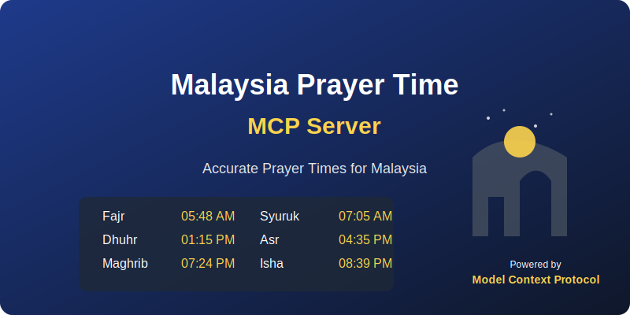

# Malaysia Prayer Time MCP Server

A Model Context Protocol (MCP) server that provides access to Malaysia Prayer Time data using the API from [mptwaktusolat/api-waktusolat](https://github.com/mptwaktusolat/api-waktusolat).

This server integrates with Claude for Desktop to provide real-time prayer times for locations throughout Malaysia.



## Features

This MCP server provides the following tools:

- **get_prayer_times**: Get prayer times for a specific zone in Malaysia
- **list_zones**: List all available prayer time zones in Malaysia
- **get_current_prayer**: Get the current prayer time status for a specific zone

## Installation

### Prerequisites

- Node.js 16 or higher
- npm or yarn
- Claude Desktop app (for using the server with Claude)

### From npm

```bash
# Install globally
npm install -g malaysia-prayer-time-mcp-server

# Or if you prefer yarn
yarn global add malaysia-prayer-time-mcp-server
```

### From Source

Clone this repository:

```bash
git clone https://github.com/yourusername/mcp-server-waktu-solat.git
cd mcp-server-waktu-solat
```

Install dependencies:

```bash
npm install
```

Build the server:

```bash
npm run build
```

(Optional) Make the server globally available:

```bash
npm link
```

## Setup with Claude Desktop

### Automatic Setup

If you chose to install the server for Claude.app during creation, it should already be available in Claude Desktop.

### Manual Setup

For manual setup, add the following to your Claude Desktop configuration file:

**macOS**: `~/Library/Application Support/Claude/claude_desktop_config.json`  
**Windows**: `%APPDATA%/Claude/claude_desktop_config.json`

```json
{
  "mcpServers": {
    "Malaysia Prayer Time MCP Server": {
      "command": "node",
      "args": [
        "/path/to/mcp-server-waktu-solat/build/index.js"
      ]
    }
  }
}
```

Replace `/path/to/mcp-server-waktu-solat` with the actual path to your server.

## Usage

### In Claude Desktop

Once set up, you can use the Malaysia Prayer Time capabilities directly in Claude Desktop.

Example prompts:

- "Show me the prayer times for Kuala Lumpur."
- "List all available prayer time zones in Malaysia."
- "What is the current prayer time status for SGR01?"

### Command Line Testing

Run the server:

```bash
npm run build
node build/index.js
```

### Development

For development with automatic recompilation:

```bash
npm run watch
```

To test your server with the MCP Inspector tool:

```bash
npm run inspector
```

## API Reference

### Zone Codes

The server uses zone codes to identify different regions in Malaysia. Use the `list_zones` tool to see all available zones.

Common zone codes include:
- `SGR01`: Selangor (Petaling, Kuala Lumpur)
- `JHR01`: Johor (Pulau Aur, Pemanggil)
- `KTN01`: Kelantan (Kota Bharu)
- `MLK01`: Melaka (Bandar Melaka)
- `NGS01`: Negeri Sembilan (Jelebu, Kuala Pilah)
- `PHG01`: Pahang (Kuantan, Pekan)
- `PLS01`: Perlis (Kangar)
- `PNG01`: Pulau Pinang (Georgetown)
- `PRK01`: Perak (Tapah, Slim River)
- `SBH01`: Sabah (Zon 1 - Tambunan)
- `SWK01`: Sarawak (Zon 1 - Kuching)
- `TRG01`: Terengganu (Kuala Terengganu)

### API Endpoints Used

This server utilizes the following endpoints from the [Malaysia Prayer Time API](https://api.waktusolat.app/):

- GET `/api/v2/solat/{zone}` - Get prayer times for a specific zone
- GET `/api/v2/zones` - Get list of all available zones
- GET `/api/v2/current-time/{zone}` - Get current prayer time status for a zone

## How It Works

The MCP server connects to the Malaysia Prayer Time API and exposes the data through MCP tools that Claude can use. When you ask Claude about prayer times, it will:

1. Recognize the request for prayer time information
2. Call the appropriate tool from this MCP server
3. Fetch the data from the Malaysia Prayer Time API
4. Format and present the information to you

## Contributing

Contributions are welcome! Please feel free to submit a Pull Request.

1. Fork the repository
2. Create your feature branch (`git checkout -b feature/amazing-feature`)
3. Commit your changes (`git commit -m 'Add some amazing feature'`)
4. Push to the branch (`git push origin feature/amazing-feature`)
5. Open a Pull Request

## License

This project is licensed under the MIT License - see the [LICENSE](LICENSE) file for details.

## Credits

- Prayer time data provided by the [Malaysia Prayer Time API](https://api.waktusolat.app/)
- Built using the [Model Context Protocol](https://modelcontextprotocol.io/)
